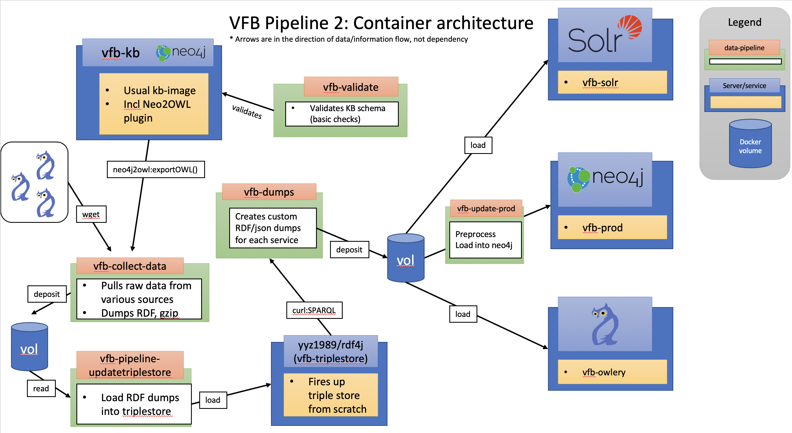

# Pipeline 2

VFB Pipeline 2 deploys VFB's KB, owlery and Neo4J production instances, including some intermediate nodes such as the integration layer and VFB triplestore. It can be divided into 5 general sub-pipelines, which are outline in the following.

## Sub-pipeline: Deploy KB (pip_vfb-kb)

Summary: This pipeline loads the current KB, applies a series of transformation steps and validates the resulting version of the KB for VFB Schema compliance.
Dependents: pip-triplestore

1. vfb-kb
   * Image: virtualflybrain/docker-neo4j-knowledgebase:neo2owl
   * Git: https://github.com/VirtualFlyBrain/docker-neo4j-knowledgebase
   * Summary: The VFB KB instance loads the [VFB KB Archive](http://data.virtualflybrain.org/archive/VFB-KB.tar.gz) and deploys it as a Neo4J instance that includes the [neo2owl plugin](https://github.com/VirtualFlyBrain/neo4j2owl). This plugin allows loading OWL ontologies into Neo4J according to a [specific schema](https://github.com/VirtualFlyBrain/neo4j2owl/blob/master/README.md), as well as serialising the (valid) Neo4J graph into OWL.
   * Access: http://kb.p2.virtualflybrain.org/browser/
2. vfb-kb2kb [one-off]
   * Image: matentzn/vfb-pipeline-kb2kb:latest
   * Git: https://github.com/VirtualFlyBrain/vfb-pipeline-kb2kb
   * Summary: The image encapsulates a (python/cypher-based) pipeline to transform the original version of the KB into a [schema-compliant](https://github.com/VirtualFlyBrain/neo4j2owl/blob/master/README.md) version.
   * Notes
     * Currently, in order to perform the KB2KB migration, a [table](https://github.com/VirtualFlyBrain/VFB_neo4j/blob/kbold2new/src/uk/ac/ebi/vfb/neo4j/data_sig_vfb.csv) is required to decide what type an entity is. This is currently on a particular branch in the pipeline repo, which needs to be taken into account when the pipeline is merged all in.
3. vfb-validate [one-off]
   * Image: matentzn/vfb-pipeline-validatekb:latest
   * Git: https://github.com/VirtualFlyBrain/vfb-pipeline-validatekb
   * Summary: The image encapsulates a (python/cypher-based) pipeline to check whether the current state of the KB is [schema-compliant](https://github.com/VirtualFlyBrain/neo4j2owl/blob/master/README.md).
   * Results of the validation can be read [here]().

## Sub-pipeline: Deploy triplestore (pip_vfb-triplestore)

Summary: This pipeline deploys an empty triplestore, collects all VFB relevant data (including KB), and pre-processes and loads the collected data into the triplestore.
Depends on: pip-kb
Dependents: pip-integration

1. vfb-triplestore
   * Image: yyz1989/rdf4j:latest
   * Git: We do not maintain this
   * Summary: The triplestore is currently an unspectacular default implementation of rdf4j-server. The container is maintained elsewhere (see docker-hub pages of image for details). 
   * Example access:
     * [Example](http://ts.p2.virtualflybrain.org/rdf4j-workbench/repositories/vfb/query?action=exec&queryLn=SPARQL&query=PREFIX%20%3A%20%3Chttp%3A%2F%2Fwww.test.com%2Fns%2Ftest2%23%3E%0A%0ACONSTRUCT%20%7B%20%3Fx%20%3Fp%20%3Fy%20.%20%7D%0A%0AWHERE%20%7B%3Fx%20%3Fp%20%3Fy%20.%7D%0ALIMIT%2010&limit_query=100&infer=true&) SPARQL query agains UI
     * [Repo summary](http://ts.p2.virtualflybrain.org/rdf4j-workbench/repositories/vfb/summary)
2. vfb-collect-data [one-off]
   * Image: matentzn/vfb-pipeline-collectdata:latest
   * Git: https://github.com/VirtualFlyBrain/vfb-pipeline-collectdata
   * Summary: This container encapsulates a process that downloads a number of source ontologies, obtains the OWL version of the VFB KB, and applies a number of ROBOT-based pre-processing steps, in particular: extracting modules/slices of external ontologies, running consistency checks and serialising as ttl for quicker ingest into triplestore.
3. vfb-update-triplestore [one-off]
   * Image: matentzn/vfb-pipeline-updatetriplestore:latest
   * Git: https://github.com/VirtualFlyBrain/vfb-pipeline-updatetriplestore
   * Summary: This container encapsulates a process that (1) sets up the triplestores vfb database and (2) loads all of the ttl files generated by vfb-collect-data into the vfb-triplestore. The image contains the configuration details of triplestore, like choice of triplestore engine.

## Sub-pipeline: Deploy integration layer (pip_vfb-integration)

Summary: This pipeline deploys the REST integration layer, which contains methods for obtaining relevant VFB-specific subsets from the VFB triplestore.
Depends on: pip-triplestore
Dependents: pip-owlery, pip-prod

1. vfb-integration-api
   * Image: matentzn/vfb-pipeline-update-prod:latest
   * Git: https://github.com/VirtualFlyBrain/vfb-integration-api
   * Summary: The integration layer is deployed as a flask-based REST api that essentially serves as a [library for SPARQL queries](https://github.com/VirtualFlyBrain/vfb-integration-api/tree/master/web/sparql) that define the minimal sub-graphs that should be used for downstream containers such as vfb-owlery and vfb-prod. This API is not designed to be user facing (lacking essential security measures such as authentication) and should therefor not be publicly exposed once the pipeline goes into production mode.
   * Example access:
     * http://int.p2.virtualflybrain.org/test (this should return the results of a limited sparql query)
     * http://int.p2.virtualflybrain.org/owlery This gets everything necessary to build owlery - dont run in browser. Note that at the moment, this query loads simply everything.
     * http://int.p2.virtualflybrain.org/prod This gets everything necessary to build pdb/production Neo4J - dont run in browser. Note that at the moment, this query loads simply everything.

## Sub-pipeline: Deploy Owlery (pip_vfb-owlery)

Summary: This pipeline deploys the Owlery webservice which is used by VFB to answer ontology queries.
Depends on: pip-integration
Dependents: None (gepetto)

1. vfb-owlery
   * Image: virtualflybrain/owlery-vfb:latest
   * Git: https://github.com/VirtualFlyBrain/owlery-vfb
   * Summery deployment of [Owlery](https://owlery.docs.apiary.io/#), a web-service for accessing basic reasoning methods of an ontology. 
   * Example access:
     * Get [subclasses](http://owl.ps2.virtualflybrain.org/kbs/vfb/superclasses?object=%3Chttp://purl.obolibrary.org/obo/FBbt_00005774%3E&direct=true) of a term

## Sub-pipeline: VFB prod (pip_vfb-prod)

Summary: This pipeline deploys the production instance of the VFB neo4j database and loads all the relevant data.
Depends on: pip-integration
Dependents: None (gepetto)

1. vfb-prod
   * Image: matentzn/vfb-prod:latest
   * Git: https://github.com/VirtualFlyBrain/vfb-prod
   * Summary: Deploys an empty, configured instance of a Neo4J database with the [neo2owl plugin](https://github.com/VirtualFlyBrain/neo4j2owl).
   * Access: http://pdb.p2.virtualflybrain.org/browser/
2. vfb-update-prod [one-off]
   * Image: matentzn/vfb-pipeline-update-prod:latest
   * Git: https://github.com/VirtualFlyBrain/vfb-pipeline-update-prod
   * Summary: The update-prod container currently takes an ontology (from the integration layer) and loads it into the the Neo4J instance (vfb-prod) using the neo2owl plugin.

# Deployment during development phase:

1. The pipeline is currently deployed as a series of connected [Jenkis jobs](https://jenkins.virtualflybrain.org/view/pip_pipeline2/). 
1. Every sub-pipeline has a Jenkins job that can be restarted manually. Every sub-pipeline will trigger all of its dependents. So if the pip_vfb-integration pipeline is started, it will automatically trigger the pip_vfb-prod and pip_vfb-owlery pipelines to redeploy as well.  
1. The whole pipeline can be restarted by simply triggering the pip_vfb_kb pipeline to be re-run. This will trigger all downstream sub-pipelines.
1. The whole pipeline is re-run every night at 4am.
1. The pipeline is exposed at p2.virtualflybrain.org